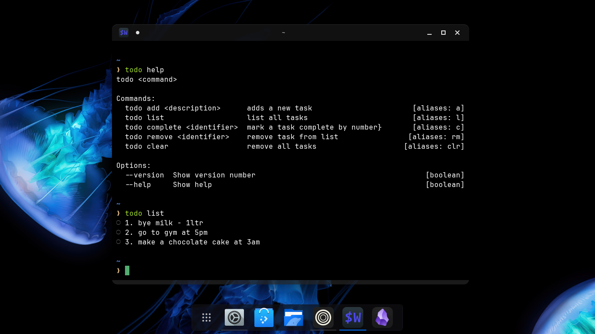

````markdown
# Todo CLI App

A simple, fast, and minimal command-line To-Do application built with Node.js.

---

## Features

- Add and list tasks quickly
- Mark tasks as complete
- Remove individual tasks or clear all
- Aliases for faster typing
- Built using Node.js

---

## Installation

Make sure Node.js is installed.

```bash
git clone https://github.com/TASh7899/todo-cli-app.git
cd todo-cli-app
npm install
npm link  # Enables `todo` command globally
````

---

## Usage

```bash
todo <command> [options]
```

To view all available commands and options:

```bash
todo --help
```

---

## Available Commands

### `todo add <description>`

Alias: `a`
Adds a new task to your to-do list.

```bash
todo add "Buy groceries"
```

---

### `todo list`

Alias: `l`
Displays all tasks with index and completion status.

```bash
todo list
```

---

### `todo complete <identifier>`

Alias: `c`
Marks the task with the given number as completed.

```bash
todo complete 2
```

---

### `todo remove <identifier>`

Alias: `rm`
Removes the task with the given number from the list.

```bash
todo remove 1
```

---

### `todo clear`

Alias: `clr`
Removes all tasks from the list.

```bash
todo clear
```

---

### `todo --help`

Displays usage information and help text.

```bash
todo help
```

---

### `todo --version`

Prints the version number of the CLI app.

```bash
todo --version
```

---

## Screenshot



---

```


```

